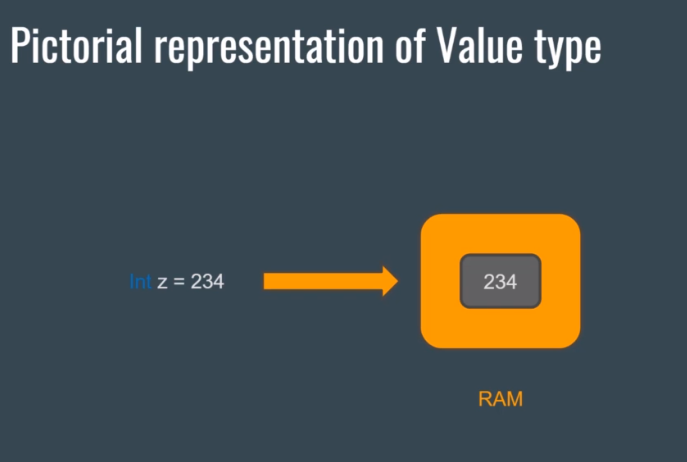
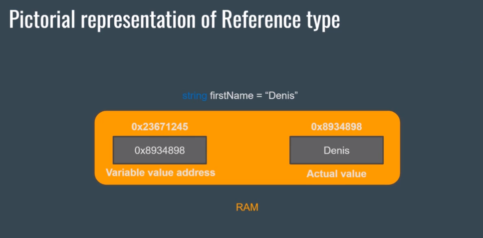

# Section 2: DataTypes And Variables

# High Level Overview of Variables and Datatypes

What is a variable?

-   A container that can take a value

# More Datatypes and Their Limits

### Variable Example with default value

```cs
public class Lecture
{
    int age = 15; // This is a variable of type integer

    public static void Main(string[] args)
    {
        Console.WriteLine(age); // The output will be 15
    }
}
```

### Variable Example with new assigned value

```cs
public class Lecture
{
    int age = 15; // This is a variable of type integer

    public static void Main(string[] args)
    {
        age = 20; //New value assigned
        Console.WriteLine(age); // The output will be 20
    }
}
```

### Variable Example with no value

```cs
public class Lecture
{
    int age; // Default is assigned 0

    public static void Main(string[] args)
    {
        Console.WriteLine(age); // The output will be 0
    }
}
```

### Variable Declared within a Method

```cs
public class Lecture
{

    public static void Main(string[] args)
    {
        // Creating a variable inside of the method
        // The variable can only get used inside of this method
        int age = 15;
        Console.WriteLine(age); // The output will be 15
    }
}
```

## Primitive data types

### Integral

-   sbyte x = 1;
    -   range from -128 - 127
-   short x = 1;
    -   range from -32,768 - 32,767
-   integer x = 1;
    -   range from -2,147,483,648 - 2,147,483,647
-   long x = 1;
    -   range from –9,223,372,036,854,775,808 to 9,223,372,036,854,775,807

Choose the smallest type your value fits into.

### Floating point

-   float x = 0.5f;
    -   range from 1.5 × 10^−45 - 3.4 × 10^38
    -   7-digit precision
-   double x = 0.5;
    -   range from 5.0 × 10^−324 - 1.7 × 10^308 -
    -   15-digit precision
-   decimal x = 0.5m;
    -   range from –7.9 × 10^−28 - 7.9 × 10^28
    -   28-digit precision

Use **float** for 3D graphics, **double** for everything (except money calculations) and **decimal** for financial applications.

### Boolean

-   bool switch = true;

Use a boolean if you want to set something to true or false (just like a toggle).

### Unicode characters and strings

-   char singleLetter = 'A';
    -   will only allow a single character literal or unicode
-   string name = "John Doe";
    -   allows multiple letters and unicodes

Use a string for a path, username, birthdate...

### Misc.

-   DateTime time = 4:30:20am 4/5/31;
    -  represents date and time, values from 0:00:00am 1/1/01 to 11:59:59pm 12 / 31 / 9999
-   enum ThreeWeekDays {monday, tuesday, wednesday};
    -  used to assign constant names to a group of numeric integer values
-   Dynamic DynaicVariable = 1;
    -  dynamic type does type check at run-time instead of compile-time.
[Different Types Link](https://docs.microsoft.com/en-us/dotnet/csharp/tour-of-csharp/types)

# Coding Standards

-   [Microsoft Docs on C# Coding Conventions](https://docs.microsoft.com/en-us/dotnet/csharp/fundamentals/coding-style/coding-conventions)

### What are Coding Standards

-   A set of guidelines, best practices and programming styles that developers followed when writing source code for a project.

### What Makes Good Coding Standards

-   Reasonable Variable Names
-   Proper Method Name
-   Comments

### Commenting styles

-   Single-Line Comments

```cs
// a bool to check if the user is logged in
bool isUserLoggedIn = true;
```

-   MultiLine Comments

```cs
/*These methods are responsible for storing user data and connecting to the database. */
```

-   XML Documentation Comments

```cs
///<summary>
//This method is very cool
///</summary>
void CoolMethod()
{
    //cool code
}
```

# Value Type vs Reference Type

## [Value Type](https://www.tutorialsteacher.com/csharp/csharp-value-type-and-reference-type)

-   A data type is a value type if it holds a data value within its own memory space. It means the variables of these data types directly contain values.

-   In other words, A value type is a data type which when declared and assigned a value, holds the **value directly ion its own memory** space.

-   The value type uses a heap to store the value.



### The following data types are all of value type:

-   bool
-   byte
-   char
-   decimal
-   double
-   enum
-   float
-   int
-   long
-   sbyte
-   short
-   struct
-   uint
-   ulong
-   ushort

## [Reference Type](https://www.tutorialsteacher.com/csharp/csharp-value-type-and-reference-type)

-   Unlike value types, a reference type doesn't store its value directly. Instead, it stores the address where the value is being stored. In other words, a reference type contains a pointer to another memory location that holds the data.

-   In other words, instead of storing the value in memory directly, **stores the memory location** of the actual data.

-   The variable here stores the memory reference of the data and not the data directly.

-   When we copy the reference type of a data type it will just copy the memory address of the data so we will then have two variables pointing to the same data.



### The followings are reference type data types:

-   String
-   Arrays (even if their elements are value types)
-   Class
-   Delegate

# [Console Methods](https://docs.microsoft.com/en-us/dotnet/api/system.console.writeline?view=netcore-3.1#System_Console_WriteLine_System_String_)

## Console Methods Explained

-   Console.Write("Text Here")
    -   Prints and keeps the cursor in the **same line**.
-   Console.WriteLine("Text Here")
    -   Prints and puts the cursor on the **next line**.
-   Console.Read()
    -   Takes a single input of type string and it **returns the ASCII value** of that input.
-   Console.ReadLine()
    -   Takes a string or integer input and **returns it as the Output** value.
-   Console.ReadKey()
    -   Takes a single input of type string and it **returns the Key info**.

### What is [ASCII](https://www.ascii-code.com/)?

    - American Standard Code for Information Interchange

### Example

```cs
Console.WriteLine("HELLO WORLD");
Console.Write("HELLO");
Console.Write("WORLD");
Consolee.ReadKey();
```

### Output

```console
Hello World
HelloWorld
```

### Example for ReadLine();

```cs
static void Main(string[] args) {
    Console.Write("Enter a string and press enter: ");
    string readInput = Console.ReadLine();
    Console.WriteLine("You have entered {0}", readInput);

    Console.Write("Enter a key and press enter: ");
    string asciiValue = Console.Read();
    Console.WriteLine("ASCII value is {0}", asciiValue);
    Console.ReadKey();
}
```

### Expected Output

```console
Enter a string and press enter: Amir
You have entered Amir
Enter a key and press enter: A
ASCII value is 65
```
